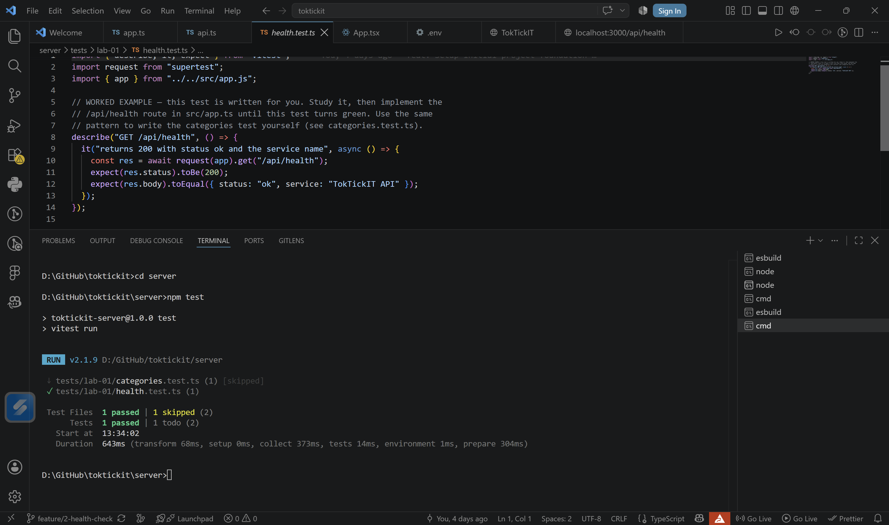
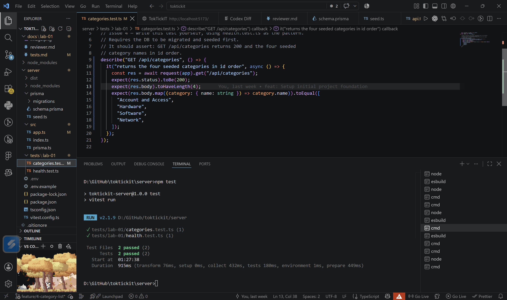
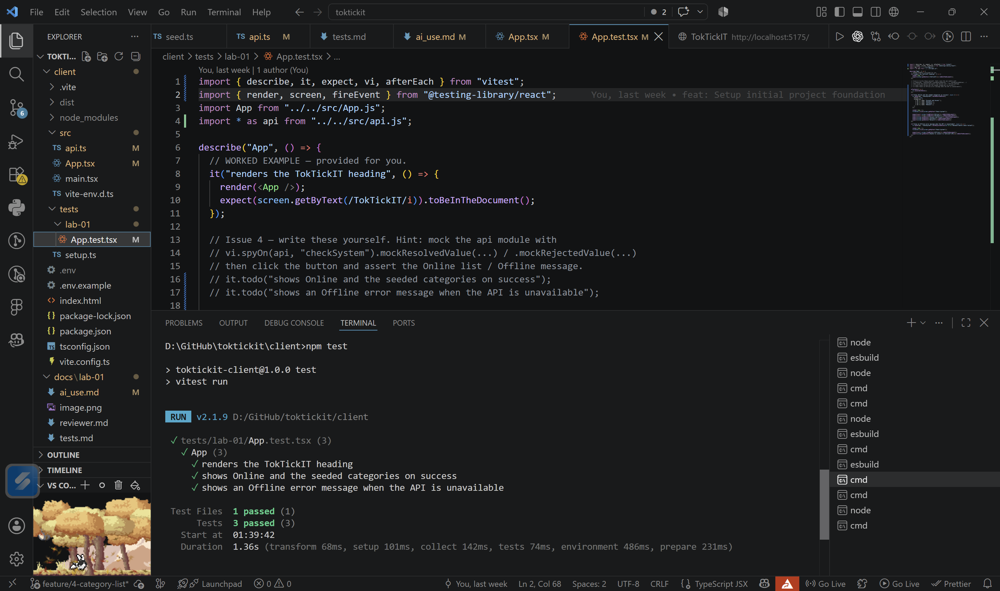

# Lab 1 — Test Plan and Evidence  (fill this in)

All test files live under server/tests/lab-01/ and client/tests/lab-01/.

| # | Tool | Test | Result |
|---|------|------|--------|
| 1 | Supertest | GET /api/health returns 200, status=ok | Pass |
| 2 | Supertest | GET /api/categories returns 4 seeded categories in id order | Pass |
| 3 | Vitest | Heading renders | Pass |
| 4 | Vitest | Success state shows Online + category list | Pass |
| 5 | Vitest | Error state shows Offline + message | Pass |

Paste your passing terminal output / screenshot below.

------------------------------------------
# Test1
| 1 | Supertest | GET /api/health returns 200, status=ok | |

> toktickit-server@1.0.0 test
> vitest run

 RUN  v2.1.9 D:/GitHub/toktickit/server

 ↓ tests/lab-01/categories.test.ts (1) [skipped]
 ✓ tests/lab-01/health.test.ts (1)

 Test Files  1 passed | 1 skipped (2)
      Tests  1 passed | 1 todo (2)
   Start at  13:34:02
   Duration  643ms (transform 68ms, setup 0ms, collect 373ms, tests 14ms, environment 1ms, prepare 304ms)
------------------------------------------
# Test2
| 2 | Supertest | GET /api/categories returns 4 seeded categories in id order | |

D:\GitHub\toktickit\server>npm test

> toktickit-server@1.0.0 test
> vitest run

 RUN  v2.1.9 D:/GitHub/toktickit/server

 ✓ tests/lab-01/categories.test.ts (1)
 ✓ tests/lab-01/health.test.ts (1)

 Test Files  2 passed (2)
      Tests  2 passed (2)
   Start at  01:27:38
   Duration  915ms (transform 76ms, setup 0ms, collect 432ms, tests 180ms, environment 1ms, prepare 449ms)

---------------------------
# Test3,4,5
| 3 | Vitest | Heading renders | |
| 4 | Vitest | Success state shows Online + category list | |
| 5 | Vitest | Error state shows Offline + message | |

D:\GitHub\toktickit\client>npm test

> toktickit-client@1.0.0 test
> vitest run

 RUN  v2.1.9 D:/GitHub/toktickit/client

 ✓ tests/lab-01/App.test.tsx (3)
   ✓ App (3)
     ✓ renders the TokTickIT heading
     ✓ shows Online and the seeded categories on success
     ✓ shows an Offline error message when the API is unavailable

 Test Files  1 passed (1)
      Tests  3 passed (3)
   Start at  01:39:42
   Duration  1.36s (transform 68ms, setup 101ms, collect 142ms, tests 74ms, environment 486ms, prepare 231ms)
